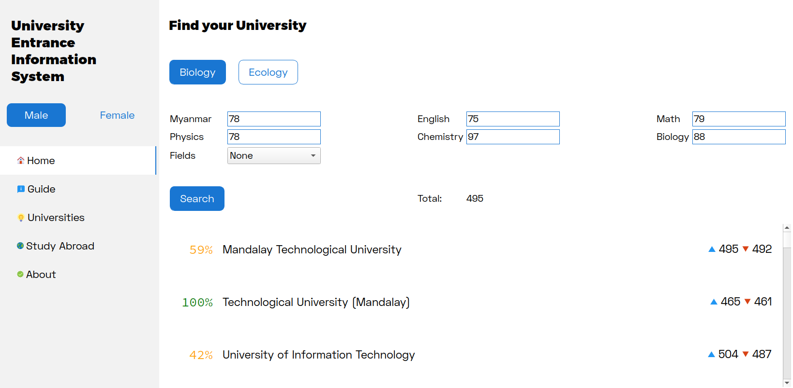

# University Entrance Information System

This is a project done for the open campus of 2019, UIT, Myanmar by a group of first year students including me. This is the original repository of the project and changes are all up-to-date.
This is simply a GUI app written in C++ with Qt, and the purpose is to implement a system that would allow easy finding the universities an individual can choose according to the matricluation exam marks.
The results of the app may have inaccuracies because what the app does is just taking the previous marks and predicting the possiblities with an algorithm, which can't have a great accuracy when dealing with things that are very heavily sensitive on various facts.
The app uses Qt as the main UI framework, and C++ as the main programming language. The data is stored in the sqlite database, and the resources are from third-parties.

## Screenshot

## Contributors

[@Nova2Shine](https://github.com/Nova2Shine)  
[@frencojobs](https://github.com/frencojobs)  
[@NyiWaiYanHtoon](https://github.com/NyiWaiYanHtoon)  
[@ChanMyaeHtoo](https://github.com/chanmyaehtoo)  
[@kzackl](https://github.com/kzackl)  
Gaw Lu Ja Naw  
Set Paing  
Su Sandi Linn  
Thandar Swe Zin  
Thin Lei Sandi  
